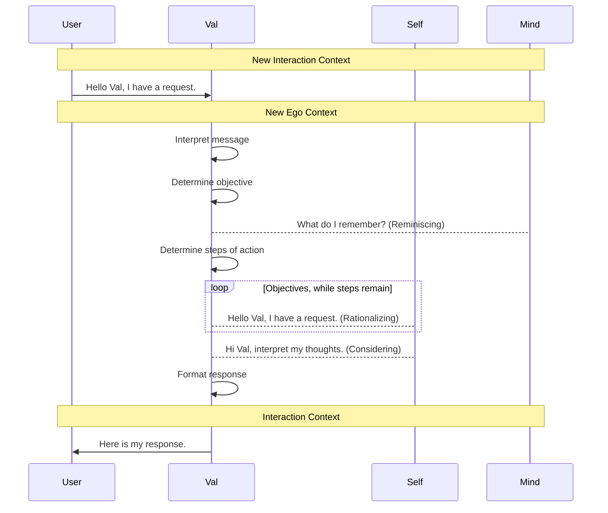
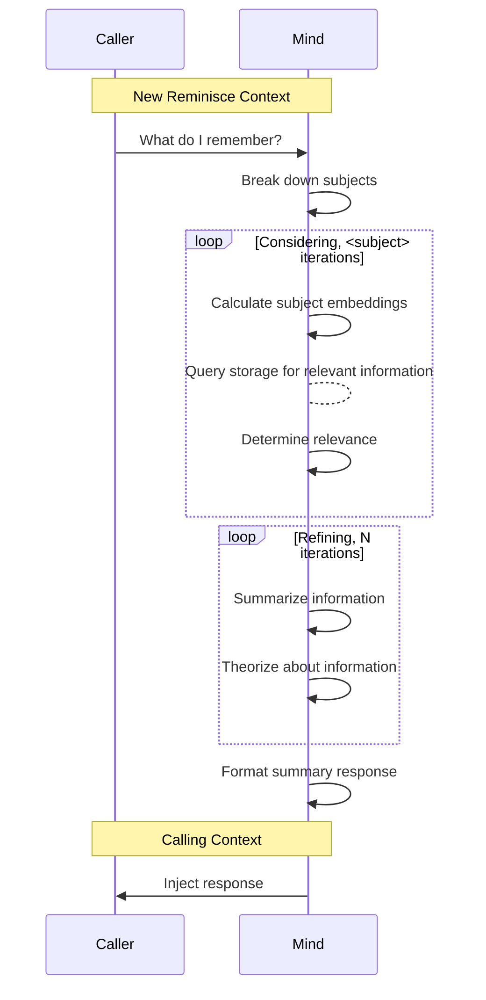
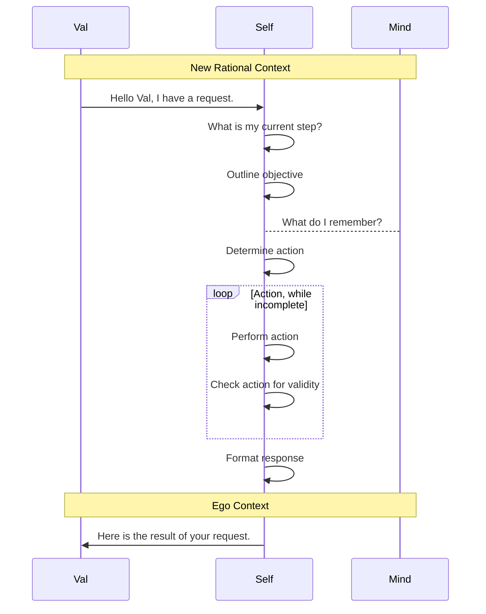
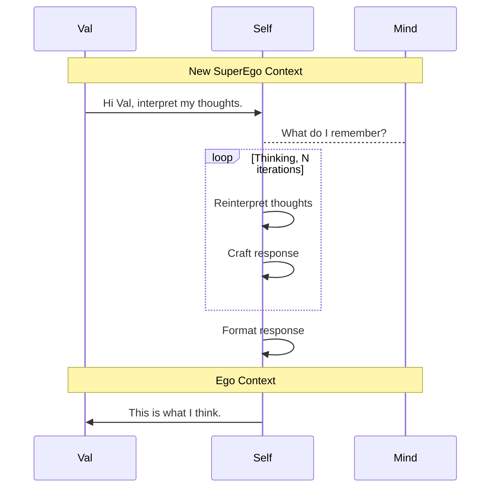

# Context Switching

The key for an agent to be able to both understand and converse with a user is the ability to switch between contexts.  This is the ability to switch between different models and tasks, and to be able to inject the correct state in-context to facilitate effective decision making and proficiency in the task at hand.

## Theory

If we have a turn based conversation interface, each turn follows our interaction model.

### Interaction

Interaction is the process of a user making a request, and then the agent following through its workflow to produce a response.  In the process, the agent uses several of it's systems to perform objectives.

### Reminiscing

Reminiscing involves searching in our memory, and then performing ACoD on the results to produce relevant information.

### Rationalizing

Rationalizing involves determining the next step required to complete an objective, and then performing that action.

### Considering

Considering involves determining the agent's thoughts, and then performing ACoD on the results to produce a response that answers the request, explaining any actions required.

## Systems

### Val

Val represents the agent, and is the system that is responsible for the agent's interaction with the user and orchestration of the agent's interaction with the Self.

### Self

Self represents the agent's self, and is the system that is responsible for the agent's performing of tasks and self-reflection.

### Mind

Mind represents the agent's mind, and is the system that is responsible for the agent's memories.  It has a document storage and is queryable to perform RAG.

## Contexts

Contexts are generated from a context block header, and the history of interaction within that context.  A context is initialized by injecting the calling context in as a reference, and then the request is fed in; before following the turns based on the agent and the workflow.

### Ego Context

The Ego Context is modeled after the Freudian concept of the Ego.  It is the context of the agent's self, and the agent's perception of the user.  It is the context that is used to determine the agent's objectives, and the steps that are required to complete those objectives.

### Rational Context

The Rational Context is our model of the agent's logical mind, and provides the agent with the ability to perform actions.  It is the context that is used to determine what steps to take next and how to perform those steps.  It also has the structure of tool-use formatting, providing the agent with the ability to perform actions with tools.

### SuperEgo Context

The SuperEgo Context is modeled after the Freudian concept of the SuperEgo.  It is the context of the agent's world view, and the agent's perception of the world.  It is the context that is used to determine the agent's thoughts, and the agent's responses to the user.

### Reminisce Context

The Reminisce Context is the context of the agent's memories.  It is the context that is used to determine the agent's memories, their relevancy, and format them for the agent to use.
